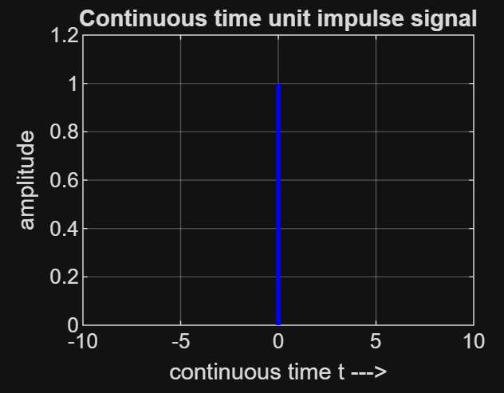
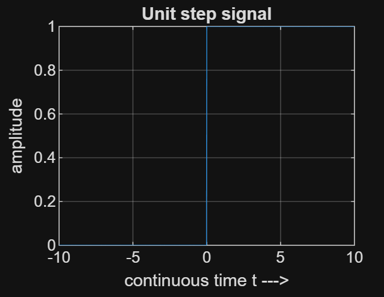
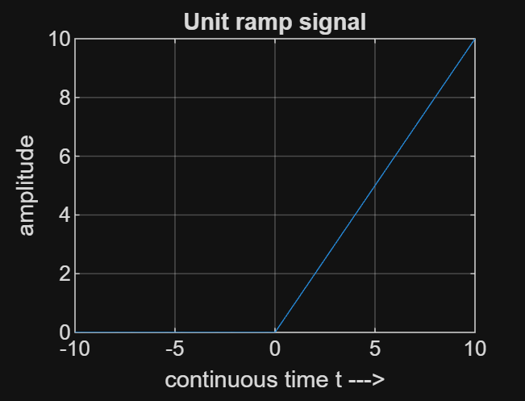
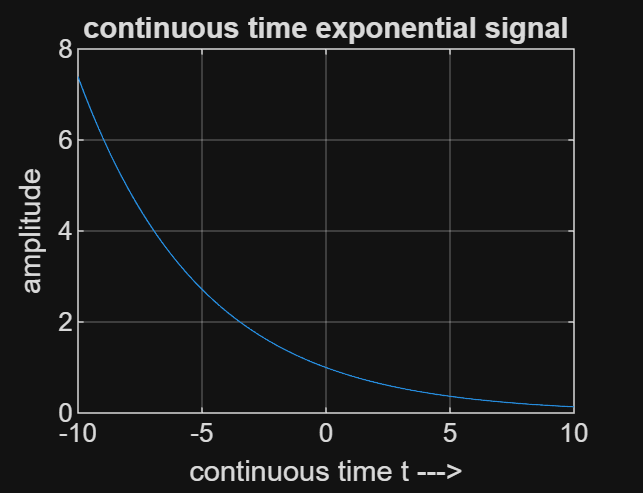
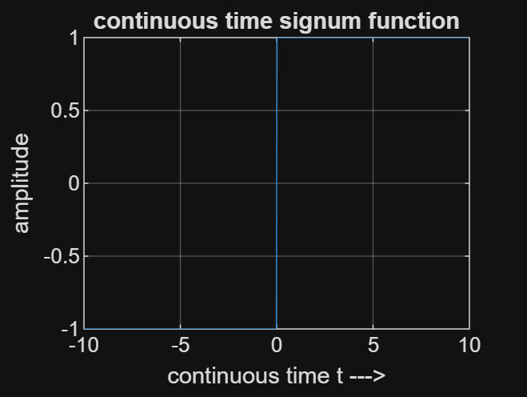
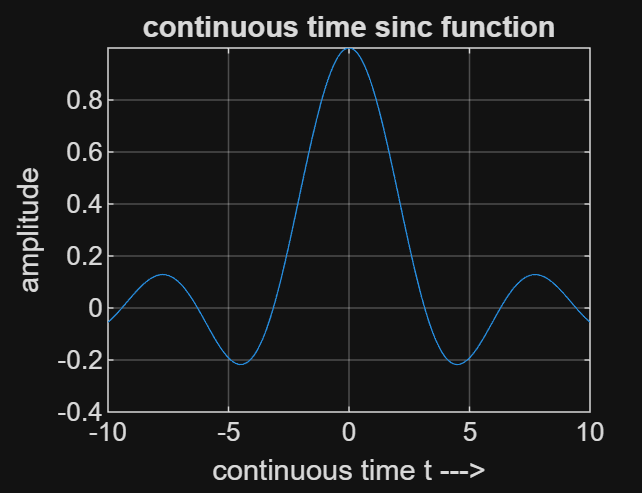

# Continuous-Time Signals MATLAB Generator

This MATLAB script generates and plots common continuous-time signals using the `plot()` function for smooth visualization. Each signal is plotted in a separate figure window, with appropriate labels and titles. The plots are saved as PNG images for easy inclusion in documentation.

## Signal Descriptions

### Unit Impulse
The unit impulse (Dirac delta function) is an idealized signal that is zero everywhere except at t = 0, where it is infinite, with an area of 1. For plotting, it is represented as a vertical line at t = 0.

### Unit Step
The unit step signal u(t) = 1 for t ≥ 0, and 0 for t < 0. It represents an abrupt change at t = 0.

### Unit Ramp
The unit ramp signal r(t) = t for t ≥ 0, and 0 for t < 0. It increases linearly for positive t.

### Exponential Signal
The exponential signal x(t) = e^{-0.2 t} defined over all t, showing growth for negative t and decay for positive t to illustrate a typical exponential behavior.

### Signum Function
The signum function sgn(t) = 1 for t > 0, -1 for t < 0, and 0 for t = 0. It extracts the sign of t.

### Sinc Function
The sinc function (unnormalized) is defined as sinc(t) = sin(t)/t for t ≠ 0, and 1 for t = 0. It features a central peak with oscillating side lobes, used in signal processing.

## Instructions for Running the Code

1. Open MATLAB.
2. Copy the provided MATLAB code into a new script file (e.g., `signals.m`).
3. Run the script by pressing F5 or typing `signals` in the command window.
4. The script will generate plots in separate figure windows and save them as PNG files in the current working directory.
5. To view the plots in the README, ensure the PNG files are in the same directory as this `README.md` file.

Note: The time range is -10 to 10 for all signals. Adjust the range or parameters (e.g., 'a' for exponential) as needed for different visualizations.
